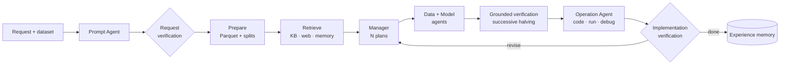

# Grounded AutoML-Agent

[](https://github.com/VioniX37/VX04/actions/workflows/ci.yml)


[](LICENSE)

**Multi-agent LLM AutoML that verifies its plans on real data, learns from experience and scales to millions of rows on a laptop.**

Upload a dataset (or point to one on disk or at a URL), describe the goal in plain language, and a team of Gemini agents does the rest:

1. They parse the request into a task specification.
2. They plan several candidate pipelines.
3. They test the candidates on growing samples of the data.
4. They write, run and debug the winner's training code.
5. They report the result on a held-out test split.

A web UI streams every step live.

This project re-implements, and extends:

> Patara Trirat, Wonyong Jeong, Sung Ju Hwang. **AutoML-Agent: A Multi-Agent LLM Framework for Full-Pipeline AutoML.** ICML 2025. [arXiv:2410.02958](https://arxiv.org/abs/2410.02958)

## What is new

| | The paper | This project |
|---|---|---|
| **Plan selection** | LLM *predicts* each plan's score; never checked | **Grounded verification**: successive halving with real runs on nested subsamples, under a time/token budget |
| **Knowledge** | Static retrieval | **Experience memory**: plans, observed scores and bug fixes from past runs on similar datasets |
| **Scale** | Small benchmark datasets, 8×A100 | **Large data** on one CPU machine: Parquet ingest, fixed splits, LightGBM/XGBoost, out-of-core text; 5M rows end to end in ~1.5 min |
| **Backbone** | GPT-4o (+ fine-tuned Mixtral) | **Gemini free tier**: role-routed models, structured output, rate limiting, response cache, Google Search grounding |
| **Interface** | Python | Web UI with live event stream, REST API and CLI (Colab/Kaggle friendly) |
| **Evaluation** | SR / NPS / CS | The same metrics, plus calibration of LLM predictions, cost, baselines and an ablation harness |

See the [comparison with the paper](docs/research/comparison.md) and the [research proposal](docs/research/proposal.md).

## Quickstart

```bash
# Backend (Python 3.11+)
cd backend
python -m venv .venv
.\.venv\Scripts\Activate.ps1        # macOS/Linux: source .venv/bin/activate
pip install -e ".[dev,eval]"
cp ../.env.example .env              # set GEMINI_API_KEY (or LLM_PROVIDER=fake to try it offline)
python -m uvicorn automl_agent.main:app --reload --app-dir src

# Web UI (Node 20+), in a second terminal
cd frontend
npm install
npm run dev                          # http://localhost:3000
```

Or headless:

```bash
automl-agent run --data ../data/samples/customer_churn.csv --prompt "Predict churn. Optimise macro F1."
```

Full instructions: [Installation](docs/getting-started/installation.md) · [Quickstart](docs/getting-started/quickstart.md) · [Colab and Kaggle](docs/getting-started/colab-kaggle.md).

## How it works



## Repository layout

```text
backend/                 Python package `automl_agent`, FastAPI app, CLI, tests, evaluation harness
  src/automl_agent/      agents · llm · planning · verification · memory · execution · tools · api
  evaluation/            benchmark runner, metrics, baselines, dataset fetcher, analysis
  tests/                 offline test suite (fake LLM)
frontend/                Next.js 16 · TypeScript · Tailwind v4 web UI
data/samples/            synthetic demo datasets and a large-data generator
docs/                    documentation site (MkDocs Material)
paper/                   LaTeX paper skeleton; figures generated by the evaluation harness
```

## Documentation

The documentation is built with MkDocs: `pip install -e "backend[docs]"`, then `mkdocs serve`. Highlights:

- Concepts: [Architecture](docs/concepts/architecture.md) · [Agents](docs/concepts/agents.md) · [Pipeline stages](docs/concepts/pipeline-stages.md) · [Grounded verification](docs/concepts/grounded-verification.md) · [Experience memory](docs/concepts/experience-memory.md) · [Large data](docs/concepts/large-data.md) · [LLM layer](docs/concepts/llm-layer.md)
- Reference: [Configuration](docs/reference/configuration.md) · [REST API](docs/reference/rest-api.md) · [CLI](docs/reference/cli.md) · [Event schema](docs/reference/event-schema.md)
- Research: [Original paper](docs/research/paper-summary.md) · [Proposal](docs/research/proposal.md) · [Evaluation protocol](docs/research/evaluation-protocol.md)
- Development: [Contributing](docs/development/contributing.md) · [Testing](docs/development/testing.md) · [Decision records](docs/development/adr/index.md) · [Changelog](CHANGELOG.md)

## Development

```bash
cd backend && ruff check . && pytest            # offline suite
cd frontend && npm run lint && npm run build
mkdocs build --strict
```

> **Safety:** generated training code runs in a supervised subprocess with time and memory limits. That is process isolation, not a security sandbox. Run the system only on machines and data you trust.

## Relationship to the original code

This implementation was written from the paper. The authors' repository ([DeepAuto-AI/automl-agent](https://github.com/DeepAuto-AI/automl-agent), CC BY-NC 4.0) was consulted only as a reference for the paper's design; none of its code is included.

## Citation

See [`CITATION.cff`](CITATION.cff). Please also cite the original work:

```bibtex
@inproceedings{trirat2025automlagent,
  title     = {AutoML-Agent: A Multi-Agent LLM Framework for Full-Pipeline AutoML},
  author    = {Trirat, Patara and Jeong, Wonyong and Hwang, Sung Ju},
  booktitle = {Proceedings of the 42nd International Conference on Machine Learning (ICML)},
  year      = {2025}
}
```

## License

Copyright (c) 2026 Grounded AutoML-Agent contributors. **All rights reserved.**
This is proprietary software: no permission is granted to use, copy, modify or distribute it without prior written consent. See [LICENSE](LICENSE).
