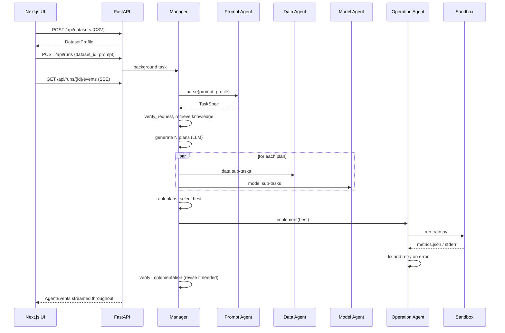

# Architecture

## Pipeline (maps to Fig. 2 of the paper)

| # | Stage (`schemas/events.py::Stage`) | Paper concept | Code |
|---|---|---|---|
| 1 | `parse` | Prompt Agent parses the instruction into JSON | `agents/prompt_agent.py`, `schemas/task_spec.py` |
| 2 | `verify_request` | Request verification | `verification/request.py` (one self-repair round via the Prompt Agent) |
| 3 | `retrieve` | Retrieval-augmented planning: knowledge retrieval | `planning/retrieval.py`, `knowledge/*.json` |
| 4 | `plan` | RAP: generate *N* diverse plans | `AgentManager.generate_plans` + `prompts/manager.md` |
| 5 | `execute_plans` | Plan decomposition + parallel pseudo-execution by the Data and Model agents | `planning/decomposition.py`, `agents/data_agent.py`, `agents/model_agent.py` |
| 6 | `select` | Execution verification: pick the best plan | `verification/execution.py::rank_plans` |
| 7 | `implement` | Operation Agent: code generation, execution, debugging | `agents/operation_agent.py`, `execution/*` |
| 8 | `verify_impl` | Implementation verification; on failure, revise and loop back to step 4 | `verification/implementation.py` |

`AgentManager.run()` in `agents/manager.py` runs steps 4 to 8 up to `MAX_REVISIONS + 1` times. Each revision passes the earlier attempts' results as `feedback` to the planner. The best working implementation is kept even if the user's target is never met.

## Sequence



## Key design decisions

- **Provider-agnostic LLM layer** (`llm/base.py`). Agents call only `complete_json(messages, PydanticSchema)`. The base class adds the schema instruction, parses JSON leniently, and asks the model to repair invalid output. Adapters implement a single `_complete` method. Token usage is tracked per run.
- **Offline FakeLLM** (`llm/fake.py`). Agents embed their inputs in a `<context>{json}</context>` block. The fake answers each schema with heuristics, so tests, CI and demos need no API key.
- **Template-grounded code generation.** Plans must pick a model family from `execution/model_registry.py`. The Operation Agent receives a working rendered template and may edit it. If every LLM-edited version fails, it falls back to the template alone. This keeps success rates high with weak or local models. Set `CODEGEN_MODE=template` to skip LLM code editing.
- **A contract, not free-form output.** Every script must write `metrics.json` (`metric`, `score`, `metrics`) and `model.joblib`. Verification reads that file.
- **Event bus + SSE** (`services/event_bus.py`). Each run is an append-only list of `AgentEvent`s, also saved to `workspace/runs/<id>/events.jsonl`. The UI can reconnect or reload and replay the history.
- **Extension hooks** (`extensions/__init__.py`). `PipelineHooks` has `on_task_parsed`, `on_knowledge_retrieved`, `on_plans_generated`, `on_plans_ranked` and `on_run_finished`. Our extension goes there, so the core pipeline stays faithful to the paper.

## Runtime layout

```
backend/workspace/
  automl.db                   SQLite: datasets + runs
  datasets/<id>/data.csv      uploaded files
  runs/<id>/events.jsonl      event log
  runs/<id>/attempt_<k>/      train.py, metrics.json, model.joblib per revision
```
