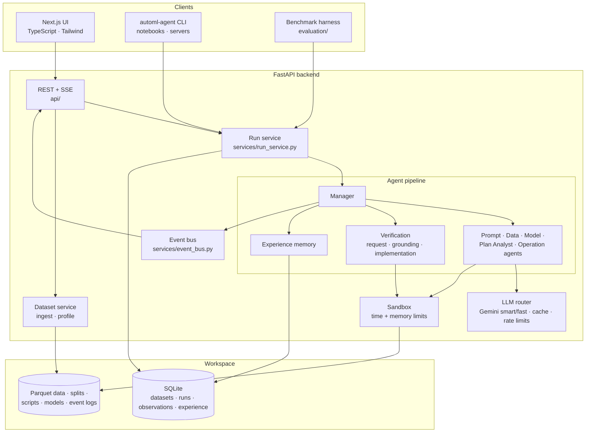
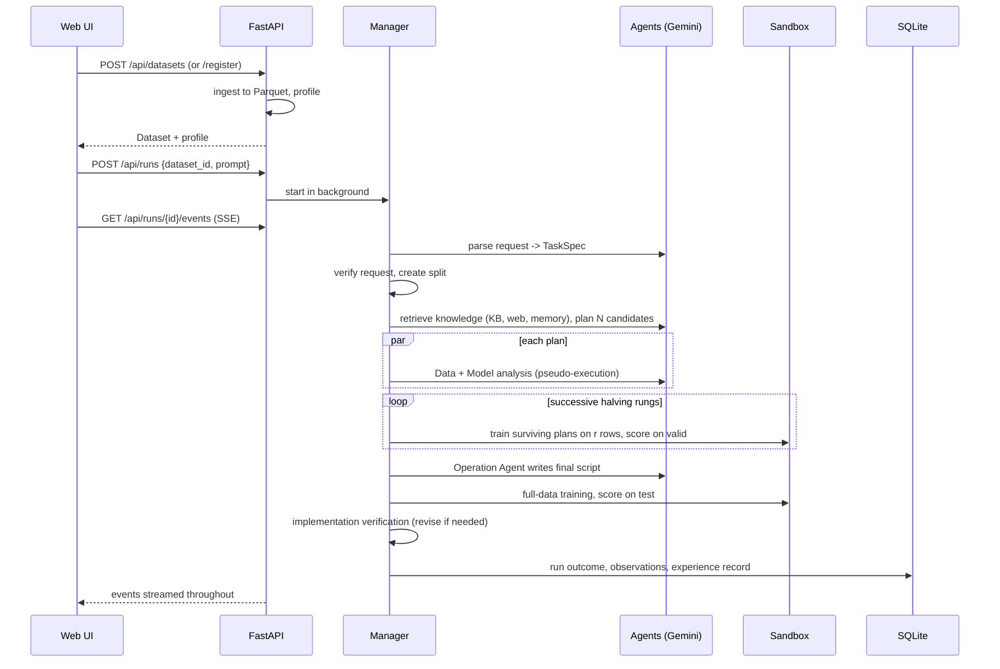

# Architecture

The system has three deployable parts: a **FastAPI backend** that hosts the agent pipeline, a **Next.js web UI**, and the **`automl-agent` CLI** for headless use. They share one workspace directory, which holds a SQLite database plus data and run artifacts.



## Backend packages

| Package | Responsibility |
|---|---|
| `agents/` | The Manager (orchestration, grounding, revisions) and the specialist agents; `RunContext`; budgets |
| `prompts/` | One role prompt per agent (Markdown with a header documenting inputs and output schema) |
| `llm/` | Gemini client, offline `FakeLLM`, role router, response cache, rate limiter |
| `planning/` | Local knowledge base retrieval, Google Search retrieval, plan decomposition |
| `verification/` | Request verification, pseudo ranking (paper), grounded successive halving, implementation verification |
| `memory/` | Experience memory: meta-features, store, retriever, pipeline hooks |
| `execution/` | Model registry, code templates, renderer, supervised sandbox |
| `tools/` | Ingest to Parquet, Polars profiling, fixed splits, heuristics |
| `schemas/` | Pydantic models shared by agents, API and UI |
| `services/` | Event bus, dataset registration, run execution |
| `storage/` | SQLModel tables and lightweight migrations |
| `api/` | REST and SSE endpoints |
| `extensions/` | `PipelineHooks`, the extension point memory is built on |

## Design principles

- **Agents reason, code executes.** LLM agents only produce structured JSON (validated with Pydantic). Everything that touches data runs as generated Python in the sandbox, against a fixed contract: read the Parquet + split files, write `metrics.json`.
- **Ground truth beats prediction.** Plans are selected on measured validation scores (see [Grounded verification](grounded-verification.md)). The final score is always computed on a test split that no agent has seen.
- **Every run is an experiment.** Configuration, predicted and observed scores, budgets and LLM usage are recorded per run, so the web UI and the benchmark harness read the same data.
- **Reproducible and quota-friendly.** Responses are cached on disk, splits are seeded, and every threshold is a setting.
- **Faithful baseline preserved.** `VERIFICATION_MODE=pseudo` and `MEMORY_ENABLED=false` reproduce the paper's behaviour for ablations.

## Request lifecycle



## Runtime layout

```text
backend/workspace/
  automl.db                       SQLite: datasets, runs, plan observations, experience records
  datasets/<id>/data.parquet      converted dataset
  datasets/<id>/splits/*.parquet  fixed train/valid/test assignment per target
  runs/<id>/events.jsonl          event log (replayed by the UI after restarts)
  runs/<id>/ground_r<k>/...       grounding runs
  runs/<id>/attempt_<k>/          final script, metrics.json, model.joblib
  llm_cache/<namespace>/          cached Gemini responses
```
