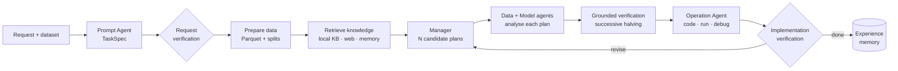

# Grounded AutoML-Agent

**A multi-agent LLM framework for full-pipeline AutoML that verifies its plans on real data and learns from experience.**

You upload a dataset (up to a few gigabytes) and describe the goal in plain language. A team of Gemini-powered agents then turns the request into a task specification, plans several candidate pipelines, tests them on growing samples of the data, and implements the winner. It writes, runs and debugs the training code, then reports the result on a held-out test split. The web UI streams every step as it happens.

This project re-implements the pipeline of
*AutoML-Agent: A Multi-Agent LLM Framework for Full-Pipeline AutoML* (Trirat, Jeong & Hwang, ICML 2025, [arXiv:2410.02958](https://arxiv.org/abs/2410.02958)). It extends it in three directions:

- **Grounded verification.** The paper ranks candidate plans on scores the LLM *predicts* without running any code. We rank them by actually training them on nested subsamples of increasing size (successive halving), under an explicit time and token budget. See [Grounded verification](concepts/grounded-verification.md).
- **Experience memory.** Every run stores what worked and what failed on its dataset: the plans, observed scores and debugging fixes. Later runs on similar datasets recall this as planning knowledge. See [Experience memory](concepts/experience-memory.md).
- **Large data on a laptop.** Data is converted to Parquet, profiled with Polars, and split into fixed train/validation/test sets. Training uses LightGBM or XGBoost with early stopping. A supervised sandbox enforces time and memory limits. 5M rows train end to end in about 1.5 minutes on a laptop CPU. See [Large data](concepts/large-data.md).

## How it works

## Where to go next

| I want to... | Read |
|---|---|
| Install it and run my first task | [Installation](getting-started/installation.md), then [Quickstart](getting-started/quickstart.md) |
| Run on Kaggle or Colab with large files | [Colab and Kaggle](getting-started/colab-kaggle.md) |
| Understand the system | [Architecture](concepts/architecture.md) and [Pipeline stages](concepts/pipeline-stages.md) |
| Configure Gemini, budgets or memory | [Configuration reference](reference/configuration.md) |
| Reproduce the experiments | [Evaluation protocol](research/evaluation-protocol.md) |
| See how we differ from the paper | [Comparison with the paper](research/comparison.md) |
| Contribute | [Contributing](development/contributing.md) |

!!! warning "Generated code runs on your machine"
    The Operation Agent executes LLM-generated Python in a separate process with time and memory limits. That is process isolation, **not** a security sandbox. Run the system only on machines and data you trust.
