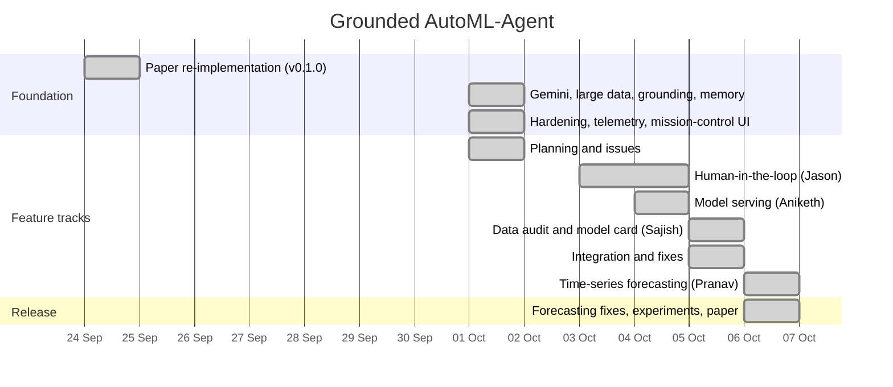

# Timeline

How the project was built, phase by phase. Dates are commit dates (IST); every entry can be traced in `git log`.

## Team

| Member | Roll no. | GitHub | Main contributions |
|---|---|---|---|
| Abhinandh A | 2024BCD0009 | `a6hinandh` | Architecture and core pipeline (LLM layer, large-data substrate, grounded verification, experience memory, evaluation harness, web UI, documentation); integration, review and fixes of the four feature tracks; experiments |
| Jason Bobby | 2024BCD0013 | Jason Bobby | Human-in-the-loop run control: approval modes, cancel, resume after restart, approval UI |
| Pranav Hariharan | 2024BCD0005 | Pranav | Time-series forecasting: task type, temporal splits, profiler, forecasting template, prompt extraction |
| Sajish Sajan Varghese | 2024BCS0001 | `Sajish06` | Pre-training data audit and post-training model card |
| Aniketh S | 2024BCS0049 | `anikethdjz` | Model serving: prediction and batch endpoints, deployment bundle, CLI, "Use this model" panel |

Indian Institute of Information Technology Kottayam.

## Overview

## Phase 0: paper re-implementation (24 September)

`62a1f32` is a working re-implementation of AutoML-Agent (Trirat et al., ICML 2025), written from the paper. It has the Prompt, Manager, Data, Model and Operation agents; request, execution and implementation verification; retrieval-augmented planning over a local knowledge base; template-grounded code generation with a debug loop; a FastAPI backend with SSE streaming and SQLite; a Next.js UI; and an offline fake LLM with a test suite. This was tagged as **v0.1.0** in the changelog.

## Phase 1: research extensions (1 October, PR #1)

The extensions that make up the research contribution were built in one day, in this order:

| Time | Commit | What |
|---|---|---|
| 00:42 | `46fb57d` | Gemini-only LLM layer: role routing (smart/fast), JSON-schema output, rate limiting, response cache, Google Search grounding ([ADR 0001](../development/adr/0001-gemini-only.md)) |
| 00:58 | `2d9a87e` | Large-data substrate: streaming Parquet ingest, Polars profiling, fixed stratified splits, LightGBM/XGBoost, out-of-core text, supervised sandbox ([ADR 0002](../development/adr/0002-parquet-ingest.md)) |
| 01:06 | `17acc48` | Grounded verification: successive halving over nested subsamples with run budgets ([ADR 0003](../development/adr/0003-grounded-verification.md)) |
| 01:21 | `7e843c3` | Evaluation harness: SR/NPS/CS, calibration, baselines, ablation matrix |
| 01:32 | `b9f1fef` | Experience memory: meta-feature k-NN recall of past plans, scores and fixes ([ADR 0005](../development/adr/0005-experience-memory.md)) |
| 01:46 | `e611515` | UI views for ingest, grounding, budgets and memory |
| 02:05 | `0dc1a37`, `f795335` | Documentation site and LaTeX paper skeleton |

## Phase 2: hardening (1 October, PR #2)

Running the system on real Gemini quotas and multi-GB files exposed operational problems, which were fixed the same day:

- **Large uploads** are buffered on the workspace drive, and a full disk is reported clearly (`0b3a261`).
- **Gemini overloads and quota errors** are handled by falling back to other models (`98628b1`) and riding out demand spikes (`b0e3732`).
- **Runs survive a page reload**, and runs orphaned by a crashed server are recovered (`238cb83`).
- **Memory recall:** ties between equally similar runs no longer error (`9e2cd50`), and at most one past run is recalled per dataset (`6a79335`).
- **Resource telemetry and per-call LLM metadata** are streamed to the UI (`ea008e7`).
- **Mission-control web UI:** a design system, a live run model derived from the event stream, and visualizations for every background process (`09b59ae` … `1870ead`).

## Phase 3: planning the feature tracks (1 October)

The four largest gaps between this project and a complete AutoML product were written up as GitHub issues, with an execution order and owners:

| Issue | Feature | Owner | Why it mattered |
|---|---|---|---|
| #3 | Model serving | Aniketh | Runs produced `model.joblib` but nothing could use it; the paper's "deployment" stage was missing |
| #4 | Human-in-the-loop run control | Jason | Runs could only be watched; the unused `on_plans_ranked` hook existed for this |
| #5 | Data audit and model card | Sajish | Grounded verification selects on *measured* scores, so a leaky column wins every time |
| #6 | Time-series forecasting | Pranav | The paper's most common real-world task type the project lacked |

The planned order was: shared groundwork first; #5's leakage checks before #6's implementation, because look-ahead leakage is the main risk in forecasting; and #5's model card after #3's bundle, because the card ships inside the bundle.

## Phase 4: feature tracks (3–6 October)

| Date | Track | Commits | Merge |
|---|---|---|---|
| 3–4 Oct | Human-in-the-loop (Jason) | `26b42ab` schema and migration · `a0f237d` cancellation · `61c987e` UI and memory · `88a2ea7`, `dbf0127` approval modal · `0046dc8` formatting | PR #8, 4 Oct |
| 4 Oct | Model serving (Aniketh) | `dc572a6` inference module · `95c5d0f` endpoints · `dc356c3` CLI · `861da96` tests · `67fc1e1` UI panel · `88d02ef` docs | merged `7dde264`, 5 Oct |
| 5 Oct | Data audit and model card (Sajish) | `1c38e38` | merged `61d1142`, 5 Oct |
| 6 Oct | Time-series forecasting (Pranav) | `4fc997f` | PR #11, 6 Oct |

## Phase 5: integration and review (5–6 October)

Each track was merged with its authors' commits preserved, then reviewed on real runs. The review found defects that the tracks' own tests did not cover. Each fix came with a regression test that failed on the code before it:

| Commit | Problem found | Fix |
|---|---|---|
| `19de8df` | Served predictions used category codes different from training; text models crashed; the wrong attempt's model could be served | Templates record training dtypes and category levels; serving replays them; parity test on three datasets |
| `693fa41` | The audit dropped continuous features as "IDs", could drop the text column, and missed multi-level categorical leaks | Identifier checks limited to discrete columns; shuffled holdout; per-category lookup scoring |
| `4d24b76` | The model card produced no diagnostics on any real run | Diagnostics computed on test rows prepared by the serving module |
| `0e5774b` | After a restart, a human decision could apply to different plans than the ones reviewed | Decisions replayed onto the saved plans; edited model families validated |
| `1a3e7ec` | The prediction form was almost always empty | `GET /runs/{id}/schema` and a form generated from it |
| `bad974e`, `24faaa4` | CLI served the wrong attempt; unattended approvals waited forever | Selected-model lookup; one-hour default timeout |
| `76b7115` | Forecasts were evaluated with a wrapped horizon (inflated scores), served as a flat line, and could not load outside the app | Shared forecasting module, rolling-origin backtests, history-based serving, date-aligned splits |

## Phase 6: experiments and paper (6 October)

The large-data study ran with Gemini on this machine (12th-gen Intel Core i5-1235U, 16 GB RAM), on two locally available datasets: the Microsoft Malware Prediction training set (8.9M rows, 83 columns, a 4.4 GB CSV converted to Parquet in 18 s) and the synthetic 5M-row conversion set.

| Time (IST) | Event |
|---|---|
| 13:33–13:39 | Offline dry run on all 8.9M rows: 6 min end to end, test ROC AUC 0.716; the experiment fits on a 16 GB laptop |
| 13:38 | Review before the experiment: revision attempts are now compared on validation, not test, scores (`8455617`) |
| 13:41 | First run (v1) started; a transient `httpx.ReadError` crashed one run, so the client was fixed to retry dropped connections (`082e1b4`) and v1 restarted |
| 13:44–16:17 | v1: 6 pipeline runs and 4 baseline runs. Finding: Gemini's code edit had subsampled the grounded malware run to 20% of the training rows. The zero-shot baseline failed on a harness bug (JSON `null` copied into Python) |
| 14:54 | Fixes: final models must train on the full split (`9a69185`); zero-shot scripts get a valid Python CONFIG (`9c682bd`) |
| 16:18–18:44 | v2 on the fixed code. The full-data check fired in production (a timed-out script's repair subsampled to 2.0M rows and was rejected). The free-tier daily quota ran out during the last pipeline run and the zero-shot baseline |
| 18:50 | Final result set merged with provenance (`backend/evaluation/results/local_large`); paper results, ablations, abstract and conclusion written from it |

Results: [Results](../research/results.md) and the paper (`paper/`).

## Test suite over time

| Point | Tests |
|---|---|
| Before the feature tracks (`820f84e`) | 82 |
| After HITL, serving and audit were integrated (`5bf7687`) | 141 |
| After forecasting was integrated and fixed (`0dda386`) | 149 |
| After the experiment-driven fixes (submission) | 153 |
