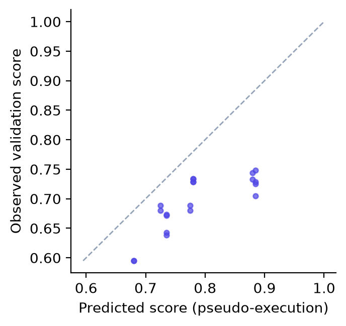

# Results

Measured results of the project. Each section names the command that reproduces it; the tables of the large-data study come from `python -m evaluation.analysis` (see the [evaluation protocol](evaluation-protocol.md)).

## Status

| Experiment | Config | Status |
|---|---|---|
| Harness smoke test (offline backend) | `smoke.json` | Passing in CI |
| Scale test, 5M rows (offline backend) | CLI | Completed: 84 s (pseudo) / 56 s (grounded), ≈ 2 GB peak RSS; see [Large data](../concepts/large-data.md) |
| Data audit, planted leak (offline backend) | `evaluation.audit_ablation` | Completed (below) |
| Time-series forecasting | `evaluation.forecasting_benchmark` | `store_sales` completed (below); `air_passengers` to re-run after the evaluation fix |
| Large data with Gemini (Malware 8.9M, conversion 5M) | `local_large.json` | Completed, one seed (below) |
| Paper datasets with Gemini (Kaggle) | `paper_tabular.json` | Not run: needs Kaggle access and roughly a day of free-tier quota |
| Remote large datasets (HIGGS, NYC Taxi, Amazon) | `large.json` | Not run: needs downloads |

## Large-data study with Gemini

Runs: `paper` (pseudo-execution selects the plan), `grounded` and `full` (grounding plus memory), on the Microsoft Malware Prediction training set (8,921,483 rows, 83 columns) and a synthetic 5M-row conversion task. Settings: one seed, `AGENT_FUSION`, 3 plans, at most one revision, and a backbone of `gemini-3.8-flash` (smart) and `gemini-3.1-flash-lite` (fast) with fallbacks. Everything ran on a laptop with an i5-1235U and 16 GB of RAM. The final result set is in `backend/evaluation/results/local_large/`, and its `PROVENANCE.md` records which run each row comes from.

| Variant | Malware: test ROC AUC | Conversion: test ROC AUC | LLM requests (malware / conversion) |
|---|---|---|---|
| `paper` | 0.7288 | 0.7772 | 8 / 6 |
| `grounded` | **0.7302** | 0.7771 | 6 / 6 |
| `full` | 0.7293 | **0.7775** | 6 / 5 |
| Optuna + LightGBM (no LLM, 15-min search) | 0.7360 | 0.7784 | 0 / 0 |

Every pipeline run succeeded (SR = 1) and selected LightGBM. The zero-shot Gemini baseline has no valid result. Its first run failed on a harness bug, now fixed, and its rerun hit the exhausted free-tier quota.

**Calibration of pseudo-execution (RQ1).** At the first grounding rung (20k rows), all 12 predicted validation scores were above the measured ones, by +0.104 ROC AUC on average. The pooled Spearman ρ is 0.77, but it only reflects that the model separates the two datasets: within a task, ρ is 0.00 for `grounded` and 0.07 for `full`. The predicted best plan was the measured best in 1 of 4 runs.

{ width="360" }

**Grounding (RQ2).** In both `grounded` runs, pseudo-execution ranked XGBoost first. Grounding measured it 0.017 (malware) and 0.028 (conversion) below LightGBM and chose LightGBM. In one run, the 80k-row rung reversed a 0.0006 lead that SGD had over LightGBM at 20k rows. The five grounding runs took 22–63 s of compute, 6–30% of one full-data training run.

**Memory (RQ3).** The malware task recalled the conversion run, but two tasks are too few to measure an effect.

**An implementation failure that grounding cannot see.** In the first run of this study, Gemini's edit of the training template added "subsample 20% if the dataset is large". The grounded run then trained its final model on 1.25M of 6.2M rows and scored 0.7164. A final run that uses less than 99% of the training split is now a failed run (`OperationAgent._enforce_full_data`). In the rerun, the check caught a second case. A script that had hit the 30-minute limit was "repaired" by training on 2.0M rows; the check rejected it, and the next repair used all rows.

## Data audit: a planted leak

Grounded verification picks the plan with the best *measured* score, so a column that leaks the target wins every time. `data/samples/customer_churn_leaky.csv` plants one: `cancellation_confirmation` equals the label. The same pipeline is run with the audit off and on. The offline backend is used, so planning is identical and only the audit differs. Reproduce with:

```bash
cd backend
python -m evaluation.audit_ablation ../data/samples/customer_churn_leaky.csv --prompt "Predict customer churn. Optimise ROC AUC." --leak cancellation_confirmation
```

| Audit | Test ROC AUC | Leak dropped | Leak's share of importance |
|---|---|---|---|
| off | 1.0000 | no | 93.6% |
| on | **0.7613** | yes | 0.0% |

Without the audit, the selected model is useless in practice: it reads the answer from a column that would not exist at prediction time. With the audit, the score is the honest one.

## Time-series forecasting

Each model family is scored on the held-out **test block** (the last 15% of dates) with a rolling-origin backtest: every `horizon` steps a new forecast is made from all actual values before it, for at most `horizon` steps. The baselines are scored the same way. Reproduce with:

```bash
cd backend
python -m evaluation.forecasting_benchmark ../data/samples/store_sales.csv --target sales --time date --series store_id --freq D --horizon 14
```

`store_sales` (synthetic: 5 stores × 180 days, weekly seasonality, promotions, trend; horizon 14, daily):

| Model | sMAPE (%) | MAE | RMSE |
|---|---|---|---|
| LightGBM, direct multi-horizon (global) | **8.57** | **14.23** | **19.36** |
| ETS (additive Holt-Winters) | 8.59 | 14.82 | 19.69 |
| Seasonal-naive (floor) | 9.79 | 15.91 | 21.81 |

LightGBM beats the seasonal-naive floor by 1.2 sMAPE points and is level with ETS. These numbers do not depend on the LLM backend.

`air_passengers` (public, monthly, single series) is registered in the dataset fetcher (`python -m evaluation.datasets.fetch air_passengers`) and is still to be re-run with the command above (`--target passengers --time date --freq MS --horizon 12`).

!!! note
    Results from the offline `fake` backend only validate the machinery; its "predictions" are fixed priors. Do not report them as findings.
